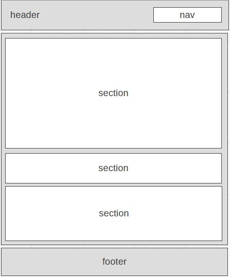
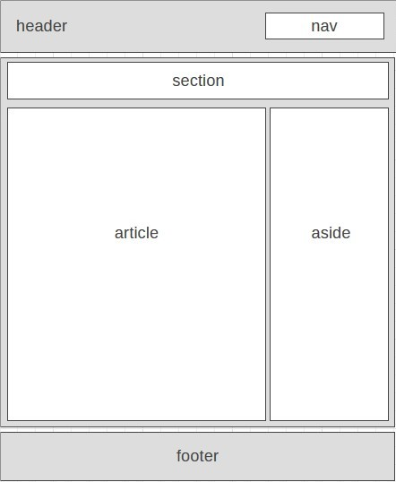

# Development Strategy

> Acme Web Design: Code Along

* In this project we will make a simple corporate website that is based on the example of Acme Web Design by Traversy Media. From the [wireframe](#wireframe) we can see the HMTL layout that will be covered in this project and respective style with CSS will be made accordingly.
* Here you can also see how the project is developed step by step (0-x) as per Agile values, through branches containing a user story. It means that we have to see the development of this company site based on the perspective of the web visitor, what do they want to know or seek in this company site? Then we applied it to the development our page. We can see what is needed to be done in each branch in order to answer to the user story and its needs.
* This project is a great exercise for those who want to get familiar with Agile values to develop a project. It will be useful (by making branches) when we need to try and make some changes or alternative without disturbing the master file. Then once we are sure about the changes, then we can merge the branch to the master file.   

---

## Wireframe

<!-- include a wireframe for your project in this repository, and display it here -->
<!-- wireframe.cc is a good site for getting started with wireframes -->
wireframe for homepage 

 
 
wireframe for about and service page 

 

---

## 0. Set-Up

__A User can see my initial repository and live demo__

### Repo : Master Branch

1. Generate an new repo from this [Template](https://github.com/adekimpianna/w3-validation-template)
1. Clone the repo
1. Write initial, basic README
1. Write `development-strategy.md` file
1. Add a wireframe or a design of html layout
1. Push the change
1. Turn on GitHub Pages

---

## 1. User story: First time knowing the company

_As a site visitor, I want to know what the company is_

### Branch(es)

1. Add a brach named `1-title`
2. After html1 and css are done, commit
3. Adjust `development-strategy.md`, if needed

### HTML

1. Put up a title on head and other meta families
1. Put up title content and navigation on header
1. Put up a copyright to symbolize an official page of the company on footer

### CSS

1. Create a separate css file
2. Add styling on new elements

---

## 2. User story: Introduction to their business 

_As a site visitor, I want to know what their business is and the standout point of this business_

### Branch(es)

1. Add a brach named `2-basic-info`
2. After html and css are done, commit
3. Adjust `development-strategy.md`, if needed
4. Merge it

### HTML

Add an introduction section about this company and their business competitive advantage description (persuasive words, such as affordable)

### CSS

Add styling on new elements

---

## 3. User story: Getting more interested about their business

_As a site visitor, I want to know their business specifications and their activities, updates etc._

### Branch(es)

1. Add a brach named `3-additional`
2. After html and css are done, commit
3. Adjust `development-strategy.md`, if needed
4. Merge it

### HTML

1. Add a newsletters section: users can receives updates about the company as an option. 
1. Add skills section as an additional content

### CSS

Add styling on new elements

---

## 4. User story: Want to know more about the company

_As a site visitor, I want to know the history of this company, what they do, where I can reach them_

### Branch(es)

1. Add a brach named `4-about` 
2. After html and css are done, commit
3. Adjust `development-strategy.md`, if needed
4. Merge it

### HTML

1. Add About Us section
2. Add what do we do section

### CSS

Add styling on new elements

---

## 5. User story: Interested in their services

_As a site visitor, I want to know their service, the cost_

### Branch(es)

1. Add a brach named `5-services`
2. After html and css are done, commit
3. Adjust `development-strategy.md`, if needed
4. Merge it

### HTML

Create Service Packages 

### CSS

Add styling on new elements

---

## 6. User story: Interested in services outside of the packages 

_As a site visitor, I want to know how it is going to be if I have a customized request_

### Branch(es)

1. Add a brach named `6-quotation`
2. After html and css are done, commit
3. Adjust `development-strategy.md`, if needed 
4. Merge it 

### HTML

Create quotation request box

### CSS

Add styling on new elements

---

## Finishing Touches

1. Add another branch named `7-responsive-design` to Start the responsive design, then merge it!
1. Next, validate the code to check for any last mistakes, fix it.
1. Last, write final, complete README on master is also fine:
  - [makeareadme.com](https://www.makeareadme.com/)
  - [bulldogjob](https://bulldogjob.com/news/449-how-to-write-a-good-readme-for-your-github-project)
  - [meakaakka](https://medium.com/@meakaakka/a-beginners-guide-to-writing-a-kickass-readme-7ac01da88ab3) 

